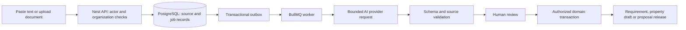

# PropertyOS: Market, AI, and Engineering Assessment

Date: 2026-09-15. Source snapshot: local `47f7aa0`, including an existing uncommitted property-edit change. Read alongside [repo context](./repo_context.md).

## Executive verdict

**High risk for an external launch; worth developing through a focused internal pilot.**

Property OS already has a substantial commercial brokerage application foundation. The best investment is to make one complete leasing workflow trustworthy, then use AI to reduce manual intake, matching, proposal preparation, and follow-up work. Adding a general chatbot before repairing authorization and data quality would amplify existing defects.

The user wants three audiences: internal Property OS staff, commercial brokerage teams, and property owners/leasing teams. Support all three in the product strategy, but release them in this order:

1. **Internal Property OS:** prove daily use, inventory freshness, time saved, and safe operations.
2. **External brokerage teams:** sell the proven requirement-to-proposal workflow with isolated accounts, onboarding, and support.
3. **Owners/leasing teams:** add asset permissions, lease records, occupancy, obligations, and renewals. An owner feedback/availability portal can arrive earlier than a full owner product.

Suggested positioning, to validate with buyers: **“Turn your commercial property inventory and incoming requirements into verified shortlists, client-ready proposals, and tracked leasing outcomes.”**

### What would make this fail?

- Brokers still maintain WhatsApp and spreadsheets because entering data here takes longer.
- Inventory is stale, so polished AI proposals contain unavailable space or wrong rent.
- Owners can see a brokerage's private clients, notes, or negotiated terms.
- Every pilot needs custom fields and workflows that become separate forks.
- AI saves five minutes but introduces fifteen minutes of fact-checking.
- An impressive dashboard hides incomplete notifications, weak recovery, or missing permission checks.

## 1. Evidence and limits

This review used the codebase graph for discovery, current source/schema/configuration, representative frontend and test code, local typechecking/unit tests/lint, and current competitor product pages. It is not an exhaustive penetration test or live production audit.

**Verified locally:** both apps typecheck; 26 backend suites / 197 tests pass. Backend lint: 1 error / 424 warnings. Frontend lint: 4 errors / 47 warnings. Direct service probes confirm query-construction defects described below. Local Node was 25.8.1; CI specifies Node 20.

**Not verified:** full build, browser acceptance, database-backed E2E, deployed behavior, actual hosted CI status, real customer metrics, current production data volume, data retention configuration, or backup restoration. Test/configuration existence does not prove operational readiness.

### Existing foundation versus missing product

| Capability | Evidence-based state | What it means |
|---|---|---|
| Building → floor → unit inventory | Models, routes, services, UI present | Extend this domain; do not rebuild it |
| Geography, verification status, contacts, media | Implemented structures and flows; security gaps remain | Useful starting point for trusted inventory |
| Worker changes and admin review | Change requests, change items, snapshots exist | Reuse the review concept for AI, after integrity review |
| Clients, requirements, shortlists | Implemented; requirement schema is shallow | Add structured needs and robust relationship checks |
| Proposals | Drafts/items/field selection/XLSX export present | Stabilize, snapshot and connect to feedback |
| PDF proposals | Legacy renderer ends an empty document | Not a finished client-delivery capability |
| Tasks, follow-ups, site visits, deals | Implemented service/UI surfaces | Verify lifecycle and notification behavior end to end |
| Commissions/invoices | Basic records and status updates | Not a complete accounting or receivables system |
| Imports/exports/maps | Implemented modules | Import recovery, authorization and scale need work |
| Organization support | Organization model and nullable IDs exist | Not proven multi-tenant isolation |
| AI | No implementation found in inspected modules/schema/targeted graph search | New product capability, not an incremental model switch |
| Owner leasing operations | No dedicated Lease/Tenant/LeaseObligation models found | New domain work is needed |
| Telemetry/testing | Sentry, Winston, unit tests, E2E files and CI exist | Keep them; improve behavioral coverage and release gates |

## 2. Market challenge and product boundaries

### Competition makes “AI real-estate CRM” a weak pitch

Buildout markets a connected CRE brokerage platform with property-data structuring, proposals, outreach and follow-up automation. Therefore, generic proposal writing and contact management are not a defensible differentiator. This is a comparison of published product claims, not independent testing. [Buildout](https://www.buildout.com/)

Sell.Do markets an AI-native real-estate platform for Indian businesses. Geography alone is not enough differentiation. Its positioning is evidence of competing supply, not evidence that its customer segment exactly matches Property OS's. [Sell.Do](https://www.sell.do/)

VTS Lease markets leasing pipelines, proposals, cash-flow analysis, occupancy/vacancy visibility and renewals. A serious owner product must understand leases and asset outcomes, beyond storing property listings. [VTS Lease](https://www.vts.com/vts-lease)

**My inference:** the most promising initial advantage is reliable local commercial inventory, fast capture of messy incoming requirements, explainable matching, familiar proposal formats, and low onboarding effort. Whether buyers value this enough to switch remains unproven.

### Three audiences, one shared foundation

| Audience | Daily problem | First product package | Buyer outcome | Keep separate/private |
|---|---|---|---|---|
| Internal Property OS | Scattered information and inconsistent execution | Capture, verification queue, shortlist, proposal, visit/follow-up | Faster response; fewer stale options; accountable work | Staff access and review privileges |
| Brokerage | Requirements, owners, listings and deals scattered across tools | Isolated workspace, import assistance, matching, proposals, pipeline | Less admin time; faster credible proposals | Clients, commissions, notes, negotiated terms |
| Owner/leasing | Vacancy, competing offers, expiring leases and obligations | Asset workspace, availability confirmation, offer comparison, lease/renewal tracker | Better leasing visibility; fewer missed dates | Rent roll, lease terms, tenant data and internal approvals |

Shared does not mean mutually visible. The same physical building can be referenced by several firms while each owns separate private records. Start with private organizational inventories and explicit sharing. Defer a universal building registry until governance and duplicate resolution are justified.

### Differentiation hypotheses to test

1. Input in English/Hindi/Hinglish can be reviewed faster than manual entry.
2. Freshness and missing-information warnings make shortlists materially more credible.
3. Commercial-specific comparisons—carpet versus chargeable area, rent basis, CAM, deposit, parking, possession and lock-in—matter more than fluent copywriting.
4. Firms will pay for a complete reviewed workflow and onboarding, not a conversational interface alone.
5. Owners will share availability through a limited portal, but will resist unrestricted sharing of their tenant and financial data.

## 3. Engineering debt and launch blockers

P0 = before external access or AI retrieval; P1 = before a paid pilot promises the affected workflow; P2 = improve as usage validates it. Findings are based on source unless explicitly marked as a probe.

| ID | Priority | Finding and evidence | Concrete task / acceptance condition |
|---|---|---|---|
| D01 | P0 | `OrgGuard` only acts on a decorator, bypasses ADMIN, and attaches scope without query enforcement. Clients controller/service do not use organization scope. `organizationId` is nullable on core records. | Separate platform and tenant administration; require server-derived ownership on creates; enforce tenant access on lists, IDs, nested records, exports, jobs and storage. Two-organization tests must demonstrate denial across every surface. |
| D02 | P0 | `SearchService.searchProperties/searchUnits` spread geography `OR` before adding text-search `OR`, replacing authorization predicates. Direct probe confirmed geography vanished. | Compose `AND: [accessPredicate, filterPredicate, textPredicate]`; integration tests combine text, geography, role and organization filters. |
| D03 | P0 | `GeographyGuard` does not put `userId` in scope; proposal list expects it. A no-geography probe produces `OR: [{}]`. Actual DB result was not exercised. | Pass actor separately; use explicit empty/deny-all semantics; test no-assignment worker, creator access and mixed-geography items. Never rely on undefined Prisma filters. |
| D04 | P0 | Proposal XLSX endpoint lacks geography decoration; export service loads by proposal ID and checks field roles, not object access. `userId` is not used for authorization. | Authorize proposal and each exported item/attachment before reading data; enforce identical policy for preview/download/background jobs. Forbidden export must produce no artifact. |
| D05 | P0 | Deals service uses `assignee: true`; User includes `passwordHash`; global transform recursively serializes fields rather than redacting them. | Explicit safe user projections/response DTOs everywhere. Add an API test asserting hashes/tokens never appear at any nesting level. Source-level exposure path; no real credentials were queried. |
| D06 | P1 | Repeated object keys drop `gte` when `lte` exists for rent/area. Probe shows only upper bounds. `searchProperties` accepts min/max area without applying them. | Merge bounds, distinguish zero from absent, validate min ≤ max and area basis; test qualifying/excluded records, not just query invocation. |
| D07 | P1 | Proposal `addItem` explicitly checks building geography only for building items; DTO checks presence, not hierarchy. | Validate unit → floor → building linkage and actor access for every item type; reject conflicting parent IDs and inactive/deleted entities. |
| D08 | P1 | `ProposalItem.snapshotJson` exists but exporter reads live entities; legacy `unitIds` coexists; PDF rendering is stubbed. | Choose relational items as canonical, migrate legacy records, version client releases, store immutable released data, implement a real PDF or withdraw the unsupported endpoint. |
| D09 | P1 | Export status becomes `exported` before XLSX serialization completes; re-export can overwrite a later proposal lifecycle status. Image fetching is sequential and lacks explicit timeouts/byte caps. | Separate artifact-job status from commercial status; mark artifact ready only after storage succeeds; bounded downloads, retries, per-job limits and authorized storage reads. |
| D10 | P1 | Client/deal lists and direct loads do not consistently exclude `deletedAt`, despite soft-delete methods. | Define archive/trash/restore behavior across search, dashboards, linked records, exports and AI; tests must prove deletion removes normal visibility. |
| D11 | P1 | Import confirm creates an entity and then marks its row completed in separate operations; concurrent calls and interrupted processing lack an evident idempotency boundary. | Claim rows atomically; use durable import-row identity, transactional row outcome and resumable jobs. Retry must not create duplicates; partial failures stay visible. |
| D12 | P1 | Financial values use `Float`; shortlist entity references are UUID fields without explicit relations; proposal item uniqueness includes nullable columns. | Design Decimal/minor-unit money plus currency/rounding; add relationship checks and duplicate constraints valid for each item type. Reconcile data before constraints. |
| D13 | P1 | Render config disables Redis; notification service logs and returns when queues are absent; SMS/push use console providers. | Declare capabilities in health/admin UI; enable a durable queue/worker for promised reminders and AI; persist delivery state and expose failure/retry. Auth mail is a separate path—do not assume it is disabled too. |
| D14 | P1 | Unit tests pass but representative search tests only assert that Prisma was called. Proposal browser test expects old routes and CSV while current implementation exports XLSX. | Replace superficial assertions; fix E2E contracts/auth envelope; add real DB and browser critical journeys to required CI. |
| D15 | P1 | Lint fails in both apps. CI omits browser acceptance/build jobs. Render auto-deploys on commit; local configs do not establish a required-check deployment gate. | Repair lint errors; add build, API/E2E and migration checks; deploy verified artifacts with health checks and rollback. Verify hosted settings separately. |
| D16 | P1 | Media/export code constructs public storage URLs and includes related media broadly. | Separate publishable photos from private documents; private objects by default, authorized short-lived URLs, upload limits/type verification, scanning, retention and deletion. Bucket exposure itself was not inspected. |
| D17 | P1 | Clerk and legacy JWT paths coexist; tests use legacy test-login while Render selects Clerk. | Decide supported modes; verify disabled users, organization changes, sessions, invitation flow, and production rejection of test-only auth. Avoid rebuilding authentication unnecessarily. |
| D18 | P2 | Free-text geography and canonical location IDs coexist; broad `any` contracts and old docs conceal domain mismatches. | Normalize locations with reviewable mapping; generate/validate transport types; update docs from verified behavior. Prioritize dangerous boundaries over blanket refactors. |

### Query probe evidence

Using actual services with an in-memory database spy (no production database):

```text
Input: worker allowed-state + property search "tower" + rent 100..200
Query: text OR only; monthlyRent { lte: 200 }; no allowed-state predicate

Input: worker allowed-state + unit search "office" + area 1000..2000
Query: text OR only; carpetArea { lte: 2000 }; no allowed-state predicate

Input: proposal list with denyAll=true and no geographic assignments
Query: { OR: [{}] }
```

These are confirmed query-construction defects. A database-backed regression test is still necessary to demonstrate and prevent each end-to-end effect.

## 4. Prioritized AI opportunities

All entries below are **proposed, not completed**. Value/effort are relative judgments, not measured ROI or delivery estimates. “First” follows the relevant P0/P1 repairs.

| ID | Feature | Users | Value / effort | Sequence | What AI does; what code/humans do |
|---|---|---|---|---|---|
| A01 | Requirement extraction from pasted text | Internal, brokers | High / medium | First | AI extracts a draft; user confirms budget/area basis, location and must-haves |
| A02 | Explainable property matching | Internal, brokers | High / medium | First | Code enforces hard constraints and access; AI interprets soft preferences and explains retrieved facts |
| A03 | Grounded proposal assistant | Internal, brokers | High / medium | First | AI drafts rationale; code inserts verified figures/units and renders approved templates |
| A04 | Brochure/PDF/email-to-inventory intake | All | High / high | Next | Extract candidate fields with page/snippet evidence; review duplicates and conflicts before saving |
| A05 | Hindi/Hinglish voice note capture | Internal, brokers | High / medium | Next | Transcribe and draft visit notes/tasks; user verifies names, numbers and dates |
| A06 | Inventory freshness assistant | All | High / medium | First, mostly rules | Rules flag age/missing fields; AI summarizes discrepancies and drafts verification requests |
| A07 | CSV column mapping and cleanup suggestions | All | High / medium | Next | AI proposes schema mappings; deterministic validation/import handles values and writes |
| A08 | Visit debrief → next actions | Internal, brokers | High / medium | Next | Summarize client feedback, reasons for rejection, and draft tasks; explicit approval to create/send |
| A09 | Client-specific follow-up drafts | Brokers | Medium / medium | Next | Use approved interactions and current deal state; suppress when contacted/replied/closed |
| A10 | Daily work briefing | Internal, brokers | Medium / small | Next | Explain overdue tasks and stale deals from deterministic queries; link every assertion |
| A11 | Lease abstraction with citations | Owners | High / high | Owner phase | Extract clauses, dates and amounts by page; reviewer verifies before activating obligations |
| A12 | Lease amendment comparison | Owners | High / high | After A11 | Identify changed clauses across versions; resolve which version governs with human review |
| A13 | Renewal/obligation briefing | Owners | High / medium | After A11 | Deterministic calendar triggers; AI summarizes context and drafts renewal preparation |
| A14 | Authorized document Q&A | All | Medium / high | After access/provenance | Retrieve only permitted source chunks; answers cite sources or abstain |
| A15 | Natural-language portfolio reports | Managers, owners | Medium / high | Later | Map to an allowlisted report definition; code computes totals; no arbitrary model SQL |
| A16 | Photo classification and quality review | All | Medium / medium | Later | Tag document/photo types, blurry/duplicate images; never infer legal area or structural safety |
| A17 | Comparable-property summaries | Brokers, owners | Medium / high | Later | Summarize permissioned comparables with date/sample caveats; calculations remain explicit |
| A18 | Deal prioritization suggestions | Brokers | Unproven / high | Later | Begin with explainable rules; predictive learning needs labeled outcomes and bias evaluation |
| A19 | Floor-plan extraction | Brokers, owners | Unproven / high | Experiment | Draft labels/areas from legible plans; human verifies scale and unit interpretation |
| A20 | Portfolio anomaly explanations | Owners | Medium / high | After lease/accounting data | Rules identify changes; AI explains documented drivers without inventing causes |

### A01: the fastest route to demonstrable value

Example input: “Need 3,000–4,000 sqft furnished office around Baner, moving in November, max ₹3 lakh/month, 4 parking.”

1. User pastes the message; source is saved with access and retention controls.
2. AI proposes structured fields and verbatim supporting spans.
3. UI highlights unresolved facts: carpet or chargeable area? Rent alone or all-in? Which November date/year? Is parking mandatory?
4. User edits/confirms. Nothing is silently inferred from missing data.
5. Confirmation creates/updates a requirement using normal domain authorization and audit.

**Acceptance proposal:** on a separately held-out set of at least 100 representative, permissioned messages, ≥95% accuracy on explicitly stated critical fields; all unsupported mandatory values are blank/flagged. Review time must improve over manual entry. Report errors by language, format and field—not just one average.

### A02: matching must respect commercial reality

Hard filters: organization/access, location, available date, area basis, budget basis, mandatory building/property characteristics. Unknown required information yields “needs verification,” not “matches.” Rank only eligible results using transparent preferences. A weighted deterministic baseline comes before embeddings.

Return for each candidate: supported matches, trade-offs, missing information, last verification date, source record/version and normalized cost components. Search the full authorized candidate set, not just one frontend page.

**Acceptance proposal:** no known hard-constraint violations in test fixtures; evaluate top-five usefulness on broker-labeled historical requirements. Promote an AI ranking layer only if it beats the rules baseline on held-out cases and does not worsen safety or latency.

### A03: proposal generation is a data-release workflow

Select items → refresh/check critical facts → draft narrative → review → release immutable version → capture client feedback. Figures come from structured records; AI cannot invent rent, availability, amenities, ownership claims or negotiation authority. Snapshot the actual released document, record versions, selected fields, author and review time.

**Acceptance proposal:** 100% agreement between displayed critical figures and approved source snapshot in evaluation fixtures; no internal fields in client artifacts; repeat downloads of the same release are identical. A changed property creates an explicit refresh/new release, not a silently altered old proposal.

### A11: owners need a lease system before a lease chatbot

Add Lease, LeaseParty, LeaseVersion and LeaseObligation concepts before activating reminders. Support multiple documents and amendments, effective dates, conflicting terms, notice periods, recurring escalations, termination and supersession. Extracted dates are drafts until reviewed. A late amendment must cancel/recalculate obsolete future reminders without deleting historical evidence.

**Acceptance proposal:** reviewed critical fields are required for activation; evaluate extraction on representative leases and amendments; verify every scheduled deadline with deterministic date fixtures. Extraction is assistance and must not be presented as a legal interpretation or ownership verification.

## 5. Non-AI product backlog that makes AI useful

All are **proposed additions or extensions**, not claims that basic CRUD is missing. Dependencies reference debt/AI items above.

| ID | Addition / extension | Audience | Priority / dependency | Observable completion |
|---|---|---|---|---|
| P01 | Guided data import and onboarding checklist | All | First; D11 | Import sample, correct errors, reconcile counts and reach first useful shortlist |
| P02 | Inventory verification ownership and expiry | All | First | Every critical availability/price fact has source, verifier, verifiedAt and reviewDueAt |
| P03 | Duplicate review and merge | All | First | Merge candidate records with preview, link preservation and audit; no automatic destructive merge |
| P04 | Structured commercial requirements | Brokers | First; A01/A02 | Area/rent basis, furnishing, parking, possession, must-haves, currency and ranges are explicit |
| P05 | Side-by-side occupancy cost comparison | Brokers, owners | First; D12 | Consistent rent/CAM/parking/deposit/escalation assumptions, with unknowns visible |
| P06 | Client proposal portal | Brokers | Next; D04/D08 | Revocable, expiring scoped access; view/shortlist/comment/request visit; no internal data |
| P07 | Versioned templates and brand settings | Brokers | Next; D08 | Template changes cannot alter previously released proposals |
| P08 | Site-visit calendar and conflict handling | All | Next | Time zone, participant availability, reschedule/cancel and reminder deduplication |
| P09 | Lost-deal and rejected-property reasons | Brokers | First | Structured outcomes with optional notes, forming later evaluation/learning data |
| P10 | Interaction timeline | All | Next | Approved notes, calls/messages metadata, meetings and tasks linked to records |
| P11 | Lead assignment and response SLA | Brokers | Next | Ownership, due time, escalation, reassignment, absence coverage |
| P12 | Mobile quick capture and resumable uploads | Internal, brokers | First | A worker can save a minimum valid record and resume interrupted media upload |
| P13 | Offline drafts and conflict resolution | Field teams | Later | Queued changes show conflicts and never overwrite newer server data silently |
| P14 | Saved searches and availability alerts | Brokers | Next; D02/D06 | Notifications respect filters/access and stop when search is disabled |
| P15 | Owner availability portal | Owners | Next | Owner confirms only assigned assets; changes enter verification workflow |
| P16 | Owner asset/leasing dashboard | Owners | Owner phase | Occupancy and vacancy are derived from active lease/space data, not listing count |
| P17 | Lease register and amendments | Owners | Owner phase; A11 | Effective lease history and parties attach to correct spaces/assets |
| P18 | Lease obligations and renewal calendar | Owners | Owner phase; P17 | Reviewed deadlines, responsible person, escalation and completion evidence |
| P19 | Leasing-offer comparison/approval | Owners | Owner phase | Versioned terms and delegated approval limits; no implied acceptance |
| P20 | Rent-roll export and accounting integration | Owners | Later; P17/D12 | Reconciled integration with source IDs and retry-safe synchronization |
| P21 | Commission splits and receivables | Brokers | Later; D12 | Explicit entitlement, approval, partial payments, reconciliation and reversals |
| P22 | Tenant invitation and asset permissions | Owners | Owner phase; D01 | Owner, asset manager, leasing user and invited broker see only granted records |
| P23 | Organization membership and offboarding | All | Before external sales | Invitations, role changes, session/access revocation and record reassignment |
| P24 | Usage, plan limits and billing | External | Before scaled sales | Entitlements enforced server-side; manual paid pilots may precede self-service billing |
| P25 | Data export, retention and account closure | External | Before external sales | Export includes promised records; closure removes derived AI/search data under declared policy |
| P26 | Customer support and service health | External | Before external sales | Traceable job errors, support workflow, incident ownership and restore rehearsal |
| P27 | Permissioned broker-owner sharing | Brokers, owners | Later; D01/P22 | Explicit field grants, expiry, revocation, source attribution and recipient audit |
| P28 | Workflow templates by team type | All | Later | Versioned configuration within one codebase; no customer forks |
| P29 | Integration API/webhooks | External | Later | Scoped credentials, signatures, replay protection, versioning, rate limits and delivery log |
| P30 | Funnel and product usage analytics | Internal, external | First | Track intake → review → proposal → feedback → visit; measure outcomes by workspace |

### Do not build early

- A nationwide marketplace: supply freshness, rights, duplicate resolution, moderation and demand acquisition are separate businesses.
- Fully autonomous negotiation, outreach, lease acceptance or payments: errors have external consequences and authority is not defined.
- Automated “correct market rent” or investment-return claims: no representative verified transaction dataset was established.
- A foundation-model training program or fine-tuning before a labeled evaluation set exists.
- A microservices rewrite, separate vector database, or multi-agent framework without measured need.
- Full property-management accounting, maintenance/helpdesk, building IoT or residential consumer search in the first release.

## 6. Recommended architecture

### Alternatives considered

| Option | Complexity/time | Reliability/security | Operating cost | Reversibility | Assessment |
|---|---|---|---|---|---|
| A. Existing app + structured rules + human-reviewed AI jobs | Moderate, incremental | Explicit existing boundaries; repair access first | Bounded model and worker usage | High: disable AI, retain manual workflow | Recommended |
| B. Existing app + external workflow automation service | Faster for isolated prototypes | Extra credentials, data processors and retry boundaries | Subscription plus execution costs | Medium; workflow/provider dependency | Useful for experiments with authorized data; core domain writes still use Property OS APIs |
| C. Autonomous agent platform with separate services/vector stack | High initial and maintenance effort | Harder permissions, recovery and evaluation | More infrastructure and unpredictable work | Low/medium | Defer until simpler architecture demonstrably fails |

**ADR-01 (proposed):** retain Next.js/NestJS/PostgreSQL/Prisma; add a worker process from the same backend codebase and restore durable Redis/BullMQ operation. Use a narrow provider adapter for structured AI responses. Begin with rules-based matching. Add permission-filtered document retrieval only for validated document use cases; consider PostgreSQL vector support later if benchmarked need justifies it.



The model proposes data. Existing domain services enforce permissions, state transitions and writes. Approval cannot bypass authorization. Document instructions are untrusted content; source text cannot grant tools or change policy. Schema-constrained output reduces format failures but does not make facts correct. [Structured outputs](https://developers.openai.com/api/docs/guides/structured-outputs), [agent safety guidance](https://developers.openai.com/api/docs/guides/agent-builder-safety)

### Capability boundaries

| Unit | Owns; inputs → outputs | Boundary/failure | Tests and telemetry |
|---|---|---|---|
| MAS-1 Access | Membership/asset grants; verified actor → access predicate | Organization + role + record/field permissions; deny absent scope | Cross-tenant/role/asset matrix; denied-action audit |
| MAS-2 Source intake | Source documents/messages/versions; upload → immutable source reference | Private storage; reject unsafe/oversized/unsupported files | Type/size/malware fixtures; upload/parse failures |
| MAS-3 AI execution | Jobs, attempts, usage; source reference → validated draft | Bounded retries/time/cost; failure never reports completion | Timeout/refusal/malformed-output tests; cost and latency |
| MAS-4 Review | Review decisions/evidence; draft + base version → accepted change | Re-check actor and current record; conflict returns review-required | Concurrent review/revocation tests; edits/rejection rate |
| MAS-5 Matching | Match runs and reasons; confirmed requirement → authorized candidates | Hard constraints deterministic; stale/missing data flagged | Ranked relevance and constraint violations; query latency |
| MAS-6 Proposal release | Immutable release/artifacts; reviewed selection → shareable version | Field allowlist; artifact failures do not advance deal status | Snapshot/render/download/access tests; generation failures |
| MAS-7 Integrations | Delivery attempts/calendar links; approved action → observed status | Idempotent webhooks; distinguish submitted/delivered/read | Duplicate/reordered webhook tests; retry/dead-letter counts |
| MAS-8 Owner leases | Lease versions/obligations; reviewed lease → schedule/dashboard | Asset permissions; supersession recalculates future work | Amendment/date/renewal cases; overdue verified obligations |

MAS units are capability boundaries, not instructions to create eight independent services. Split each approved unit into small implementation tickets after its contracts are settled.

### Proposed data contract for the first AI slice

These are new designs, not existing schema names. Exact migrations require tenant/backfill decisions first.

- `SourceRecord`: UUID, non-null organizationId, actorId, kind, contentHash, immutable version, private storage/text reference, createdAt, retentionUntil/deletedAt. Scope retrieval by organization and resource grant.
- `AiJob`: UUID, organizationId, actorId, kind, sourceId/sourceVersion, inputHash, idempotencyKey, schemaVersion, promptVersion, provider/model identifier, status, attemptCount, token usage, estimated/actual cost, errorCode and timestamps. Unique `(organizationId, idempotencyKey)`; same key/different input is a conflict.
- `AiDraft`: UUID, jobId, structured payload, field evidence, unresolved questions, baseRecordVersion. Missing facts remain null. Retain reviewed edits separately from original extraction.
- `ReviewDecision`: draftId, reviewerId, accepted/edited/rejected, selected fields, reviewedAt, applied entity/version. Apply accepted writes and decision atomically; one successful application per draft.
- `OutboxEvent`: UUID, organizationId, type, schemaVersion, payload IDs, createdAt, publishedAt. Domain transaction commits before event publication; workers deduplicate event IDs.
- Later: `MatchRun`, `ProposalRelease`, `ShareGrant`, `Lease`, `LeaseVersion`, `LeaseObligation`. Define these when the corresponding package is approved.

### Proposed API contract sketch

Use current `/api/v1` and response/error envelopes. The following is specific enough to evaluate the design, but not a complete implementation specification for every input kind.

```http
POST /api/v1/ai/intakes
Authorization: Bearer <session>
Idempotency-Key: <opaque client key>
Content-Type: application/json

{
  "kind": "requirement_text",
  "clientId": "<authorized-client-uuid>",
  "text": "Need 3000–4000 sqft furnished office in Baner..."
}
```

Proposed pilot limits: 20,000 text characters, 10 active jobs/workspace, one validated source per intake. These limits must be reviewed against pilot documents and budgets.

- Return `202 { data: { id, status: "queued" }, meta: { requestId, timestamp } }` only after durable job/outbox commit.
- Derive organization and actor from server session/membership; never trust request-supplied organization IDs.
- `GET /api/v1/ai/intakes/:id`: scoped job status; ready draft has fields, evidence, unresolved questions and base version.
- `POST /api/v1/ai/intakes/:id/apply`: `{ draftVersion, fields }`; validates the final requirement and current access, writes once, returns created/updated entity. Repeated identical apply returns the prior result; conflicting apply returns 409.
- `POST /api/v1/requirements/:id/match-runs`: uses confirmed requirement version; returns authorized candidates and reason fields, never unrestricted SQL or model-selected permissions.
- Errors: 401 unauthenticated; 404 absent/inaccessible resource; 409 stale version or key conflict; 422 invalid brief/output; 429 quota exceeded; 503 unavailable worker/provider. Provider refusal is a visible terminal/review state, never empty success.
- Job states: queued → running → needs_review / failed / cancelled; needs_review → applied / rejected. Retrying creates an attempt without losing previous evidence. Cancellation stops future actions; it does not undo already incurred provider cost.
- Event: `ai.intake.requested.v1 { eventId, organizationId, jobId, sourceId, sourceVersion }`. Queue payload contains IDs, not full documents or tokens. Reauthorize record use at execution and at apply.

### Failure, security and cost behavior

- Start with at most three transient-error attempts with backoff/jitter and provider-specific retry headers. Do not retry invalid input or refusals blindly.
- Claim work with leases/locks; recover expired work; prevent duplicate application with database uniqueness/transactions. Provider calls may be repeated after a crash even when domain writes are exactly-once.
- Quotas apply per organization and actor. Reject work before calling a provider when a cap is reached. Bound tokens, document pages, bytes, execution duration and concurrency.
- Do not put full private documents, passwords, contacts or raw prompts into general logs. Log IDs, versions, latency, tokens, error class and request IDs.
- Manual entry, filtering and proposal editing remain usable during provider outages.
- Never allow retrieved content to request a different organization, bypass review, invoke arbitrary network requests, or execute SQL.
- Data removal must invalidate derived drafts/chunks/embeddings and access caches; retained audit records follow the declared retention policy.

## 7. AI development workflow and evaluations

Use AI in building the platform as well as inside it:

1. Architect validates the current repo context, defines domain behavior, permission matrix and examples.
2. Write one capability contract and a small ticket with explicit files, schema/API changes and acceptance criteria.
3. Coding assistant implements within those boundaries; no invented tenancy, money or lease semantics.
4. AI review proposes missing cases, then humans/automated tests verify them. A model reviewing another model is not independent proof.
5. CI runs formatting/lint/types, relevant unit tests, real database access tests and browser critical journeys.
6. Every prompt/model/schema change runs a versioned evaluation set before release.
7. Pilot in shadow/draft mode; record corrections, time saved and failures; enable broader actions only after evidence.

Evaluation set must include English/Hindi/Hinglish, ambiguous area/rent units, contradictory source documents, outdated availability, prompt injection in documents, revoked users, two organizations, unknown answers, empty searches, provider timeouts and repeated jobs. Keep training/examples separate from the held-out evaluation set. Obtain rights to use customer inputs; do not pool private brokerage data for training by default.

Metrics: field-level accuracy, unsupported claims, hard-constraint violations, source citation correctness, human edit/reject rate, review time, cost per accepted draft, time to client-ready proposal, and outcome funnel. Financial figures and deadlines need stricter checks than narrative style.

## 8. Commercial validation and unit economics

### Pilot design

- First establish a two-week internal baseline: time to record a requirement, make a shortlist, produce a proposal, and complete follow-up.
- Interview roughly 8–12 brokerage users/buyers and 4–6 owner/leasing users. These are suggested research sample sizes, not statistical validation.
- Recruit 3–5 brokerage design partners around one commercial workflow and geography; involve 1–2 owner partners in availability/lease discovery without promising the full suite.
- Import real permissioned data, onboard one team per workspace, and measure repeat use for several weeks.
- Require a commercial commitment to test willingness to pay. Internal enthusiasm is not market validation.

**Proposed continuation gates:** ≥30% lower median time to reviewed proposal; ≥60% weekly active usage among intended pilot users for four weeks; no unresolved P0; zero known cross-tenant access in the release matrix; at least three external teams prepared to pay for the defined package. These are decision targets to refine after baseline measurement, not predictions.

### Packaging hypothesis

- Internal: operations and quality baseline.
- Brokerage: workspace subscription with included active users and bounded AI usage; paid onboarding for messy data.
- Owner: asset/portfolio package with leased-space/lease limits and a separately measured document-extraction allowance.
- Shared collaboration: invite-only grants, not access to another firm's entire workspace.

Do not promise unlimited AI or set final price without measuring support and onboarding costs.

```text
Monthly contribution = subscription revenue
  - model/OCR/transcription usage
  - storage, workers, database, network and message delivery
  - payment fees where applicable
  - onboarding/support cost allocated to the account

Value hypothesis = verified hours saved × customer's chosen hourly value
Cost per accepted draft = all attempts + review cost, divided by accepted drafts
```

Example arithmetic only: 5 users × 15 minutes saved/day × 20 days = 25 hours/month. At a buyer-supplied ₹500/hour valuation, that represents ₹12,500/month of time value. None of those assumptions has been validated; it is not a recommended subscription price. Measure broker response/visit outcomes separately; do not attribute every closed deal to AI.

## 9. Implementation sequence and acceptance gates

An indicative 12-week pilot window is a planning hypothesis, not a delivery commitment. Team size, live data cleanup, hosting and lease scope are unknown. Sequence by gates if dates slip.

| Stage | Suggested window | Work | Exit gate |
|---|---|---|---|
| 0. Product/data decisions | Week 1 | Interview internal users; choose pilot asset type/location; settle ownership and roles; measure baseline | Named buyer/workflow, approved tenant boundary and acceptance dataset |
| 1. Trust foundation | Weeks 1–3 | D01–D07, D10, safe DTOs, access regression matrix, lint/test repairs | No unresolved P0; real DB denial tests; working critical path |
| 2. Credible manual workflow | Weeks 3–5 | Freshness/source tracking, structured requirements, imports, deterministic matching, proposal release/export | Internal users can complete intake → reviewed proposal → follow-up reliably |
| 3. First AI pilot | Weeks 5–8 | A01, A02 explanations, A03, evaluations, quotas, worker recovery | Beats baseline; critical facts remain grounded; manual fallback verified |
| 4. Brokerage paid pilot | Weeks 8–12 | Onboarding, usage limits, support, portal/feedback, telemetry and restore rehearsal | Repeat usage, willingness to pay and support economics measured |
| 5. Owner package | Separate gated phase | Asset permissions, lease register, A11–A13, owner reporting | Owner workflow validated; deadlines and amendments tested before reliance |

Parallelizable after contracts: onboarding research, baseline/evaluation labeling, UI review prototypes, deterministic data-quality work and CI improvements. Block AI retrieval on access fixes; block automatic lease reminders on reviewed lease semantics; block cross-firm sharing on an approved sharing model.

### File-level change map for approved follow-on work

| Area | Existing files to inspect/extend | New paths, if approved |
|---|---|---|
| Access | `Backend/src/shared/guards/{jwt-auth,roles,org,geography}.guard.ts`; `Backend/src/shared/utils/geography-filter.ts`; domain controllers/services | Explicit access-context/policy module, name to be settled in access design |
| Tenant/data integrity | `Backend/prisma/schema.prisma`; `Backend/prisma/migrations/`; `Backend/src/prisma/prisma.service.ts` | New reviewed migrations; ownership reconciliation tooling |
| Intake/requirements | `Backend/src/modules/clients/`; `Backend/src/modules/imports/`; `Frontend/src/app/(v2)/requirements/` | Proposed `Backend/src/modules/ai-intake/`; AI review hooks/components |
| Matching | `Backend/src/modules/search/`; `Backend/src/modules/clients/`; geography helpers | Proposed matching service and benchmark fixtures |
| Proposal release | `Backend/src/modules/proposals/`; `Frontend/src/hooks/use-proposals.ts`; `Frontend/src/components/proposals/`; `Frontend/src/app/(v2)/proposals/` | Release/artifact/share-grant models after contract approval |
| Worker/runtime | `Backend/src/modules/notifications/`; `Backend/src/app.module.ts`; `render.yaml` | Worker entrypoint and AI queue; deployment target remains a decision |
| Owner package | Existing building/floor/unit/client/deal models as references | Proposed lease module and owner routes; do not overload Deal with lease accounting |
| Tests/release | `.github/workflows/ci.yml`; `Backend/test/`; domain `__tests__/`; `Frontend/e2e/` | Access matrix, AI eval fixtures, critical real browser journeys |

### Follow-on ticket groups

These are scoped work groups, **not yet builder-ready tickets**. Split them after the decisions below; each actual ticket needs exact request/response/model changes, allowed files, failure tests and a rollback plan.

| Group | Purpose | Depends on | Complexity | Review |
|---|---|---|---|---|
| T01 | Tenant/asset ownership and administrator contract | Product decision | High | Architect/security |
| T02 | Search access composition and range regression fixes | Existing access semantics | Small/medium | Security review |
| T03 | Proposal permissions and safe nested response DTOs | T01 | Medium | Security review |
| T04 | Relationship, money, deletion and retry integrity | T01 + data inventory | High | Architect/migration review |
| T05 | Real E2E/release gates and provider-mode tests | T02/T03 | Medium | Engineer |
| T06 | Freshness and normalized requirement contract | Product baseline | Medium | Domain reviewer |
| T07 | Deterministic matcher and labeled benchmark | T02/T06 | Medium | Broker + engineer |
| T08 | Snapshot proposal release and artifact jobs | T03/T04 | High | Architect |
| T09 | AI source/job/review execution and evaluation | T01/T04/T06 | High | Architect/security |
| T10 | Text intake and grounded proposal pilot | T07/T08/T09 | Medium | Broker + AI evaluator |
| T11 | Brokerage onboarding/support/entitlements | T05/T10 | Medium | Product/operations |
| T12 | Owner lease/obligation system | Owner discovery + T01/T09 | High | Leasing domain reviewer + architect |

## 10. Deployment, migration and recovery

1. Snapshot and restore-test existing data before ownership/money migrations. Classify unowned records; never assign them to the next user who logs in.
2. Use expand → backfill/reconcile → validate → enforce constraints → contract. Preserve old columns/read compatibility until migration evidence is satisfactory.
3. Deploy access fixes and regression tests before enabling another organization's access. A security rollback must not restore a known leakage path; disable the affected capability instead.
4. Deploy durable workers and health/capability checks with AI flags off. Run synthetic/permissioned jobs and provider outage/retry tests.
5. Enable AI for internal reviewers only, then selected workspaces. Pin model/prompt/schema versions per job and retain auditable results.
6. Monitor denied access, queue age, failed/stuck jobs, cost, review rejection, critical field errors and artifact failures. Assign an incident owner.
7. Rollback triggers: any cross-tenant disclosure, unreviewed external action, corrupted records, critical unsupported claims, or persistent budget/availability failure. Disable the affected feature, stop/hold pending jobs, preserve evidence, and restore a compatible release. Do not undo unrelated human edits.
8. Revoke compromised share grants and invalidate download access. Rebuild derived AI/search data from canonical records when necessary.

No deployment or production data change was performed in this review.

## 11. Second-guess review

| Risk | Probability / impact (judgment) | Prevention | Recovery |
|---|---|---|---|
| Stale inventory makes AI untrustworthy | High / high | Verification ownership, source dates, explicit unknowns | Withdraw/revise affected proposal and reverify |
| Scope leaks into search/export/AI | Demonstrated construction gaps / critical | Central access context and real DB matrix | Disable surface, revoke grants, investigate |
| Users do not adopt data entry | High / high | Minimal capture, imports, review-time measurement | Narrow workflow and remove friction before more AI |
| Integration/job duplicates | Medium / high | Idempotency, outbox, transactions | Reconcile by source/job IDs; replay safely |
| Owner scope expands into ERP | High / high | Lease/renewal package boundaries | Defer accounting/maintenance; integrate later |
| AI cost exceeds value | Medium / medium | Quotas and cost per accepted draft | Disable expensive path; return to manual/rules |
| Provider output is fluent but wrong | High / high | Field evidence, hard validation, reviews/evals | Reject draft; manual correction; evaluate before re-release |

Weakest assumption: teams will maintain sufficiently fresh inventory. Most likely early product failure: low trust in availability, even if extraction works. Hardest decision to reverse: ownership/sharing semantics for the same asset across firms. Simplification made: separate role-specific packages, one codebase, rules before semantic ranking, no autonomous external actions in the first release.

Evidence that would change the recommendation: owners show stronger paid demand than brokerages; internal data quality is already excellent; target customers primarily need lease operations; or existing CRMs solve the workflow adequately and switching cost outweighs Property OS's benefit. In that case, prioritize an integration/add-on instead of replacing the CRM.

## 12. Decisions needed and readiness

The user's three audiences are confirmed. The following remain open:

- **Needs Product Decision:** initial asset type, location, team size and highest-value daily workflow for the internal pilot.
- **Needs Architect Decision:** platform/tenant/admin/asset roles; organization ownership of existing records; how broker-owner collaboration is granted and revoked.
- **Needs Product Decision:** which source materials customers can provide and permit processing; languages; retention and hosting requirements.
- **Needs Architect Decision:** supported authentication mode, production worker hosting, AI/OCR providers, usage budget and failure limits.
- **Needs Product Decision:** owner phase limited to availability/leases/renewals, or a separately funded broader property-management product.
- **Needs Product Decision:** pilot success baseline, pricing research and named owners of data verification and customer support.

**Final readiness: Ready to prioritize and validate. Not Ready for Implementation of the complete commercial/AI platform; Not Ready for full builder-ticket generation.** The tenant/role/data ownership contract and pilot product boundaries must be settled first. Reproduced narrow defects can be converted into repair tickets immediately with their own explicit acceptance criteria.

Recommended immediate investment: fix authorization and search correctness, verify the complete manual leasing workflow, then deliver text requirement extraction plus explainable matching and reviewed proposal generation. That creates measurable value for internal Property OS and a credible brokerage pilot, while preserving a deliberate path to the owner package.
